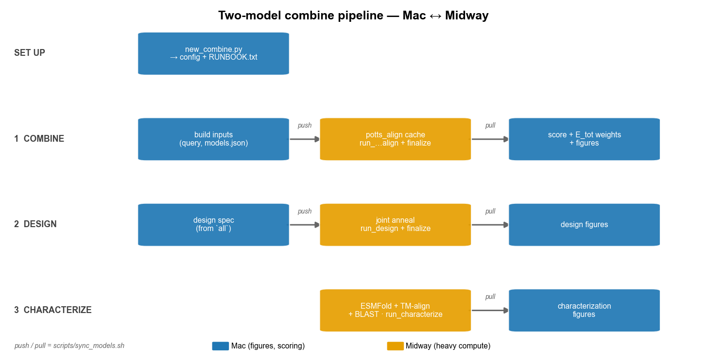
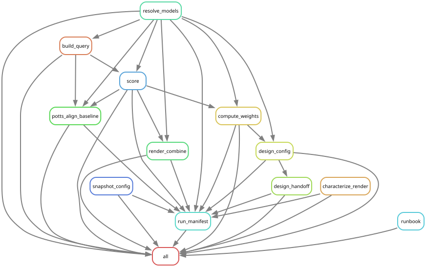

# End-to-end runbook: two trained models → designed, characterized sequences

The path from **two already-trained single-model runs in `results/`** to
**designed two-model sequences with structure + BLAST characterization and all
figures** is now **one scaffold command that writes a per-run, copy-pasteable
`RUNBOOK.txt`**. This page is the concept + the quickstart; the exact commands,
with every path filled in and only the stages you enabled, live in that generated
file.

## The workflow



Heavy compute runs on **Midway**; **all figures render on the Mac** from the tables
Midway produces (pulled with `scripts/sync_models.sh`). `sync_models.sh` always runs
**from the Mac** — `push` before a Midway stage, `pull` after; the Midway blocks
never call it. It moves three trees: `results/` (models, seed MSAs), `combine/`
(query, potts_align cache, scores, design + characterize tables), and `natural_folds/`
(the content-addressed ESMFold cache of the naturals). See `docs/MODEL_SYNC.md`.

## Quickstart

```bash
# [MAC] one command: generate a validated config, mint the run dir, write RUNBOOK.txt
python scripts/new_combine.py \
    results/CM-bm-dense/iter-002-base-model \
    results/PPIC-dense/iter-001-baseline \
    --tag potts-eval
```

That command (`scripts/new_combine.py`):

- validates each dir has `model.npy` + `inputs/msa.npy`;
- infers the model names, and picks the two error-prone potts_align knobs from the
  data itself — `pa_cross_subsample_origin` = the larger-N family (the PT cost
  driver), `query.random_length` = `min(L_A, L_B)`;
- writes a clean `config/params_combine-<run_name>.yaml` (no 30-line embedded
  runbook to prune) after round-tripping it through the same validator the pipeline
  uses; and
- mints `combine/<run_name>/iter-NNN-<tag>/` and writes its **`RUNBOOK.txt`**.

Then **open `combine/<run_name>/iter-NNN-<tag>/RUNBOOK.txt` and paste each
`[MAC]` / `[MIDWAY]` block as a unit.** It sets `RR` / `CFG` / `SNAKE` once and
threads them through every command (nothing to substitute), includes the
finalizers, and — because it is regenerated from the config on every
`snakemake … all` — can never drift from the params in effect.

Useful flags: `--method map` (scores locally, no cluster round-trip),
`--no-design`, `--no-characterize`, `--design-local`, `--run-name NAME`,
`--config-only`. Run `python scripts/new_combine.py -h` for the full list.

**Step 0 (optional) — derive a parameter-filtered model** first if a model should
contribute only *some* of its parameters (e.g. fields with couplings zeroed); it
lands a normal `results/` dir the scaffold consumes (`CLAUDE.md` "Derive pipeline"):

```bash
# [MAC]
python scripts/iter.py run derive-CM-profile "fields-only" --snakefile Snakefile.derive
```

## The three stages (what `RUNBOOK.txt` walks you through)

| Stage | Midway (heavy compute) | Mac (figures / light) |
| --- | --- | --- |
| 1. **combine** — natural energies + `E_tot` weights | `potts_align` align cache (Slurm array) | scoring, weights, `two_model_energy.pdf`, `energy_weights.pdf` |
| 2. **design** — generate sequences | the joint-anneal Slurm array | `design_*` figures |
| 3. **characterize** — fold + which-fold + BLAST | ESMFold (GPU) + TM-align + BLAST + merge | `characterization_*` figures |

Each stage is a `[MAC] build/push → [MIDWAY] one driver + finalize → [MAC] pull +
render` round-trip. The Midway drivers are one-argument (`run_potts_align_align.sh
$RR`, `run_design.sh $RR`, `run_characterize.sh $RR`, plus the `finalize_*.sh`).
Detail + cost + knobs: `docs/POTTS_ALIGN.md` §11 (align), `docs/DESIGN_TWO_MODEL.md`
(design), `docs/CHARACTERIZE.md` (characterize).

## The Snakemake DAG

`bash scripts/render_dag.sh [<config>]` regenerates these into `docs/workflow/`
(needs `brew install graphviz`). The simplified DAG (rules + dependencies):



The **full** job DAG (`docs/workflow/combine_dag.svg`) is near-identical here: this
pipeline has no Snakemake-level fan-out — the per-(query, model) and per-chain
fan-out happens on the Slurm array, *outside* Snakemake. All three artifacts are
also written as PDF/DOT alongside the SVGs.

## Where each result lands

```text
<combine_run>/
  RUNBOOK.txt                                   # the per-run copy-paste steps
  data/scores.tsv, energy_weights.json          # stage 1
  design/designed_sequences.fasta, designed.tsv # stage 2
  characterize/data/summary.tsv                 # stage 3 (from Midway)
  figs/two_model_energy.pdf, energy_weights.pdf                 # stage 1 (Mac)
  figs/design_{trajectories,phase_space,lengths,alignment}.pdf  # stage 2 (Mac)
  figs/characterization_overview.pdf, tm_A_vs_B.pdf, fold_call_breakdown.pdf  # stage 3 (Mac)
```

See also: `CLAUDE.md` (component map), `docs/POTTS_ALIGN.md` (aligner + cluster),
`docs/DESIGN_TWO_MODEL.md` (design engine), `docs/CHARACTERIZE.md` (characterization),
`docs/MODEL_SYNC.md` (Mac↔Midway transfer), `docs/two_model_progress.md`
(project status + design decisions).
